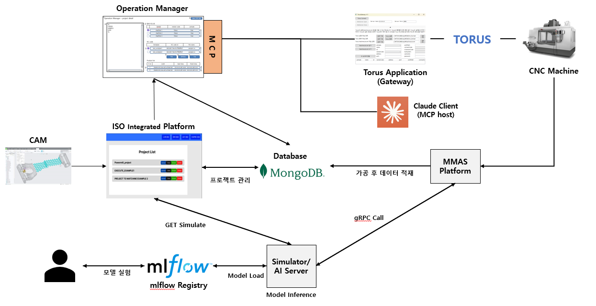

# Digital Thread Platform

## 개요


이 프로젝트는 스마트 제조 데이터 연계 및 가공 자동화를 위한 백엔드 플랫폼입니다.

3대 주요 서비스로 구성되어 있습니다.

**1. C# Wrapping DLL Server**

**2. ISO API Server**

**3. Operation Manager Server**

각 서버는 컨테이너 기반으로 구동되며, FastAPI(Python) 중심으로 다양한 제조 데이터 및 장비 인터페이스를 제공합니다.

## 1. C# Wrapping DLL Server
- 역할

    - 제조 CAD/STEP 파일(STEP242)로부터 CAD, GD&T 정보를 추출하는 핵심 C# DLL(stepdata.dll)을 Python(FastAPI) REST API로 Wrapping합니다.

    - 업로드된 .stp 파일을 받아, DLL 내부 메서드(getCADdata, getGDTdata)를 호출 후 JSON 데이터로 반환합니다.

- 주요 엔드포인트

    - /convert/cad/ : STEP → CAD 변환 (JSON 반환)

    - /convert/gdt/ : STEP → GD&T 변환 (JSON 반환)

- 구동 조건

    - Python(3.9 이상), pythonnet, stepdata.dll 필요

    - Windows 환경 권장 (DLL 호출)

## 2. ISO API Server
- 역할

    - 프로젝트, CAD/GD&T 파일, NC코드, TDMS, CAM 데이터 등 제조 엔지니어링 데이터의 등록/관리/변환을 제공합니다.

    - FastAPI 기반, MongoDB(GridFS) 사용

    - 내부적으로 C# DLL Wrapping Server와 HTTP로 연동하여 STEP → CAD/GD&T 자동 변환

- 핵심 기능

    - 프로젝트 CRUD, 파일 업로드/다운로드, 다양한 제조 파일 통합 관리 및 검증

    - CAD, GD&T 자동 변환 API

    - 작업 이력/로그 관리

- 개발/운영 환경

    - Docker 컨테이너 기반 배포

    - 환경 분리는 conda 환경 추천(예: iso_env 등)

- 통합 테스트 및 자동 검증

    - 컨테이너 내부에서

        ```nginx
        conda activate myenv

        pytest
        ```
        명령을 실행하면,

        - 통합 검증 및 예제 파일 자동 업로드/변환 검증 스크립트가 자동 수행됩니다.

        - 신규 프로젝트/샘플 STEP 파일 업로드 → CAD/GD&T 변환 → 데이터베이스 연동까지 end-to-end로 검증합니다.

    - 테스트 결과 및 업로드 로그는 콘솔 및 DB에서 확인 가능합니다.

## 3. Operation Manager Server
- 역할

    - 실제 장비(머신) 단위의 작업 큐 관리, NC 코드 가공/상태 추적, 실시간 작업 이력 관리를 담당합니다.

    - FastAPI + MongoDB + Redis 기반으로, 대규모 장비 실시간 추적에 최적화

    - 각 프로젝트별 NC 파일 업로드, 가공 큐 관리, 로그 남기기, 가공 상태 전환 등을 담당

- 주요 특징

    - SOLID 원칙 기반 OOP 구조

    - 서비스/도메인 분리, DB 의존성 주입 구조

    - RESTful API 및 WebSocket(선택적) 지원

    - 실시간 Redis 활용, 비동기 처리 최적화

## 기타 운영 참고
- 모든 주요 에러/예외는 REST 표준 응답(JSON, status code)으로 처리됩니다.

- 프로젝트/작업/파일 간 연계 구조 및 DB/스토리지 구조는 각 서비스별 README 혹은 docs/ 참고
