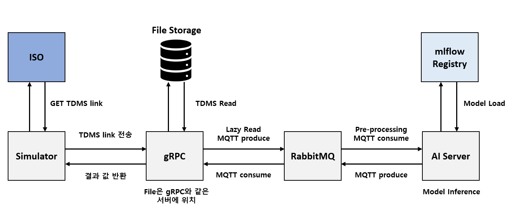

# Tdms-Simulator 통합 통신 구조
## 개요

## 시스템 구성 요소
**1. grpc**

- TDMS 파일을 파싱하고 신호(Spindle, ACC) 데이터를 chunk 단위로 gRPC 스트림으로 제공합니다.

- RabbitMQ를 통해 AI inference 요청/응답을 전달합니다.

2. ai-server

- RabbitMQ로부터 신호 chunk 데이터를 받아 MLflow 기반 AI 모델로 이상/정상 분류 추론을 수행합니다.

- 추론 결과를 RabbitMQ로 다시 발행합니다.

- PyTorch 모델은 MLflow Registry에서 관리/불러오기.

3. mmas (C# Simulator)

- ISO API 서버에서 가공할 TDMS 파일 목록을 REST로 받아옵니다.

- 각 TDMS 파일을 gRPC로 grpc 서버에 전송, chunk 단위로 데이터 처리 및 AI 추론 요청.

- 각 chunk별 추론 결과(이상/정상, 확률 등)를 실시간으로 수신 및 표시합니다.

## 전체 통신 흐름
```mermaid
graph LR
    A[mmas (C#)] --REST--> B[ISO API 서버]
    A --gRPC--> C[grpc (read_tdms.py)]
    C --RabbitMQ (raw_data_queue)--> D[ai-server]
    D --RabbitMQ (result_queue)--> C
    C --gRPC (inference result)--> A
```
**설명:**

1. mmas는 ISO API 서버에서 TDMS 파일 리스트를 받아온 후,
각 TDMS 파일 경로를 gRPC로 grpc 서버에 전달(ReadTdms).

2. grpc는 TDMS 파일을 파싱, 제품 구간별로 spindle/acc chunk를 만들어
gRPC 스트림으로 mmas에 전송, 동시에 각 chunk를 RabbitMQ raw_data_queue로도 발행(SendTdms).

3. ai-server는 RabbitMQ에서 chunk 데이터를 구독하여
AI 모델로 예측, 결과를 result_queue로 발행.

4. grpc는 result_queue에서 예측 결과를 받아
다시 gRPC로 mmas에 반환(ReceivedData).

5. mmas는 chunk별 AI 추론 결과를 실시간으로 출력/활용.

## 각 컴포넌트의 역할 요약
| 컴포넌트                 | 주요 기능                                      |
| -------------------- | ------------------------------------------ |
| grpc (read\_tdms.py) | TDMS 파싱, chunk 생성, gRPC 및 RabbitMQ 중계      |
| ai-server            | RabbitMQ 데이터 소비, AI 모델 추론, 결과 발행           |
| mmas (C#)            | TDMS 목록 조회(REST), gRPC chunk 송수신, 결과 수신/로깅 |

## 실행 방법
```shell
docker compose up --build
```